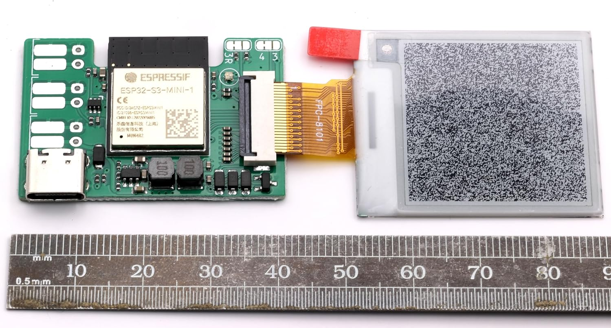

# Generic Waveshare e-paper controller board

- ESP32-S3 board (4MiB flash, 2MiB SPIRAM)
- USB-C connector (power and data)
- 4 pin USB header
- 5 pin serial header
- WS2812 RGB LED
- cut/solder pad for 3/4 wire SPI setting (default 4 wire)
- cut/solder pad for 0R47/3R reference (default 0R47)
- pads for two input contacts with BAV99 protection
- pads for power (5V-35V) instead of USB

Works with most waveshare e-paper (not quite all), including large 7.5" panel.

[Amazon UK](https://www.amazon.co.uk/dp/B0CPFM1ZJJ)